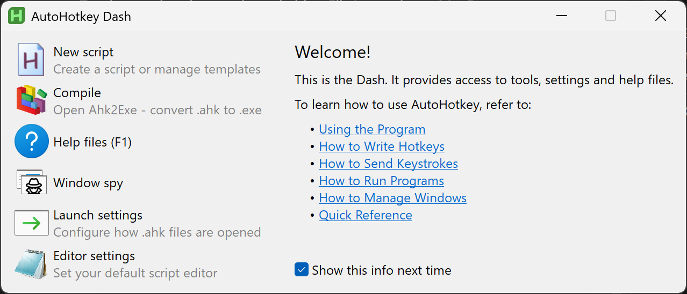
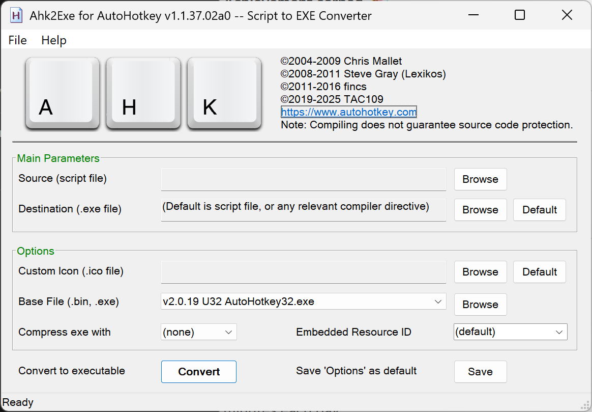
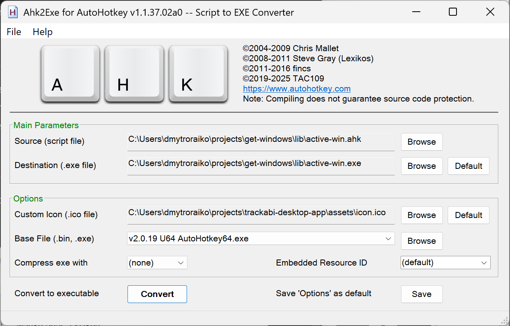

# active-win.ahk — Development notes (AutoHotkey v2)

Purpose
- Quick reference for maintaining and testing the Active Window AHK script shipped at [lib/active-win.ahk](lib/active-win.ahk).

Quick links
- Script: [lib/active-win.ahk](lib/active-win.ahk)
- Main helper functions (all in [lib/active-win.ahk](lib/active-win.ahk)):
  - [`EscapeJSON`](lib/active-win.ahk)
  - [`SaveURl`](lib/active-win.ahk)
  - [`GetAccData`](lib/active-win.ahk)
  - [`ParseAccData`](lib/active-win.ahk)
  - [`GetAccObjectFromWindow`](lib/active-win.ahk)
  - [`GetRealProcessName`](lib/active-win.ahk)
  - [`GetBrowserURL_DDE`](lib/active-win.ahk)
  - [`GetAppDisplayName`](lib/active-win.ahk)
  - [`GetProcessNameByPID`](lib/active-win.ahk)

Requirements
- AutoHotkey v2.0 (script uses v2 syntax).
- UTF-8 environment is expected (script calls FileEncoding "UTF-8").

## Setup / prerequisites
 Install AutoHotkey v2 using the [official installer](https://www.autohotkey.com/)
  - Choose the v2 installer (prefer the x64 installer on 64-bit Windows).
  - Follow the installer prompts and reboot if requested.
- Verify the installation:
  - Run a small test script (e.g., save a file test.ahk with: `MsgBox "AutoHotkey v2 is installed"` and double-click it).
  - Or run AutoHotkey.exe from the install folder to confirm it launches.
- Ensure UTF-8 handling:
  - The script relies on `FileEncoding "UTF-8"`. If you see encoding issues, confirm your AutoHotkey installation supports Unicode/UTF-8 (official installers do).
- Developer tools:
  - Use the [official documentation](https://www.autohotkey.com/docs/) and forum for API and migration notes between v1 and v2.
  

## Local testing notes
- The script normally writes JSON lines with FileAppend. To test interactively on your machine:
  - Comment out or temporarily remove FileAppend lines and uncomment the MsgBox lines (present as commented helpers in the script) to get immediate popups for debugging.
  - Example: replace ``FileAppend(jsonOutput "`n", "*", "UTF-8")`` with ``MsgBox jsonOutput`` while testing.
- When reverting to production, restore FileAppend and ensure MsgBox calls are removed/commented.

## Debugging tips
- Use small, focused changes and test with one browser at a time.
- Use MsgBox/ToolTip for quick visual feedback; revert before packaging.
- For long-running issues, log JSON to a temporary file and inspect it with a separate viewer.

## Accessibility / COM / DllCall notes
- The script relies on `oleacc\AccessibleObjectFromWindow` and `AccessibleChildren`. These calls may fail or be slow; code already retries with a short loop.
- `SendMessage WM_GETOBJECT` is used to coax certain browsers; maintain the current retry/backoff approach if adding more browsers.
- When touching DllCall signatures, validate parameter types and pointer sizes (A_PtrSize) to avoid crashes on x64 vs x86.

## UWP / ApplicationFrameHost handling
- The script contains logic to detect `ApplicationFrameHost.exe` and walk child windows to find the real UWP process. Keep that logic when modifying window enumeration.

## Performance & stability
- The script currently sleeps for `1500 ms` between iterations. If you change this, be mindful of CPU and IPC load.
- Use minimal work inside the loop; offload heavy parsing to separate functions.

Contributing / PR checklist
- Keep AutoHotkey v2 syntax.
- Test interactive changes by switching FileAppend <-> MsgBox as noted above.
- Verify UTF-8 encoding on saved logs.
- Run the script long enough to ensure no memory leaks or unreleased COM objects.
- Update this README when adding/removing functions or changing message format.

## Notes for contributors
- Document any additional local dependencies and installation steps in this file.
- When adding setup steps, keep them short and platform-specific (Windows) — include exact installer links and expected behavior.

# Build & before-push notes

Before committing changes to the origin, build active-win.exe.

1. Open the Ahk2Exe application.

2. Fill in the form (like shown on the screenshot below):
  - `Source (script file)` — Path to the script: [lib/active-win.ahk](lib/active-win.ahk).
  - `Destination (.exe file)` — Where to save the compiled .exe. Save it in the same directory as the script.
  - `Custom Icon (.ico file)` — Path to the .ico file to use for the executable (use the same icon as the Trackabi desktop app: ~/projects/trackabi-desktop-app/assets/icon.ico).
  - `Base file (.bin, .exe)` — Select a base file from the dropdown matching a pattern like: `~version~ U64 AutoHotKey64.exe` (choose the 64-bit base on 64-bit systems).

3. After building, run the .exe locally to verify it starts and behaves as expected before pushing changes.
